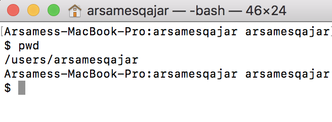
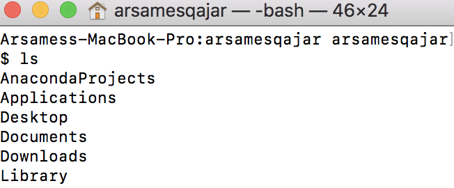

# Welcome to Git
#### `**Note: All below assumes Mac users. Sorry :/.`

## What is Git
A version control system that allows you to take "snapshots" of your project. Why is this important? For many reasons, but here are some central ones below:
1. Archive old code
2. If you make a mistake or wrote an enormous amount of unusable code, you can revert back to working code
3. Teams can work collaboratively on some code 

useful links
+ [Git branches](https://gist.github.com/blackfalcon/8428401)
+ [Git workflow](https://guides.github.com/introduction/flow/)

## Table of Contents
  * [Chapter 1 - the Terminal](#chapter-1)
  * [Chapter 2 - Installing Git on Mac](#chapter-2)
  * [Chapter 3 - Getting Started with Git](#chapter-3)
  * [Chapter 4 - Branching with Git](#chapter-4)

## 
### Step 1: The Terminal 
1. To find your terminal, spotlight search for 'terminal' and select it. See below. This is the command line interface tool you will use to control the UNIX-based operating system that the Mac OSX sits on :). If you really want to learn more, [see here](http://blog.teamtreehouse.com/introduction-to-the-mac-os-x-command-line).

2. Below, is an example of how the terminal will look like. Nice job! You're on your way now to becoming an engineer! :)

So what are you looking at here? Well, the white space is the `console` - that's where you type commands and see outputs from previously entered commands. The `command line` is where you type your command on the console.

3. Now, for some quick basics regarding the command line that will become important later on (dont worry, we will see them a lot later on as well). Below, are a couple of useful commands:
      + `pwd` = print working directory. In other words, if you want to see where you are, type 'pwd' in the command line and it will give you the directory (or `folder`) you are. See pic below - 
      + `ls` will show you the list of files in the directory you are currently in. Again, see image below: 
      + `cd` means "change directory". In other words, if I wanted to change into or go into my "Desktop" directory from the last screenshot, I would type `cd desktop`
      + `mkdir` and `touch` are about creating new folders and files respectively.  
      + `echo 'Hello, World.' > first_file.txt` is a command that will "echo" the "Hello, World" string into a new file called "first_file.txt" in your current directory. Now that you've written that string into your newly created text file, you can see it typing `more first_file.txt`.

Awesome! Now we can begin installing Git, our version controll system i.e. VCS. 

## 
### Step 2 - Installing Git on Mac
1. Before you install git,  

## 
### Step 3: Git started with Git

| Option | Description |
| ------ | -------- |
| git init   | initialize folder as git repository |
| git status | print status of files in repo i.e. shows any changes you've made since your last save/commit  |
| git add | add files to version control|
|git commit| commit i.e. "save" changes|
| git log|  show recent commits|
|git checkout| create or switch branches|
|git merge | merge/combine one branch with another