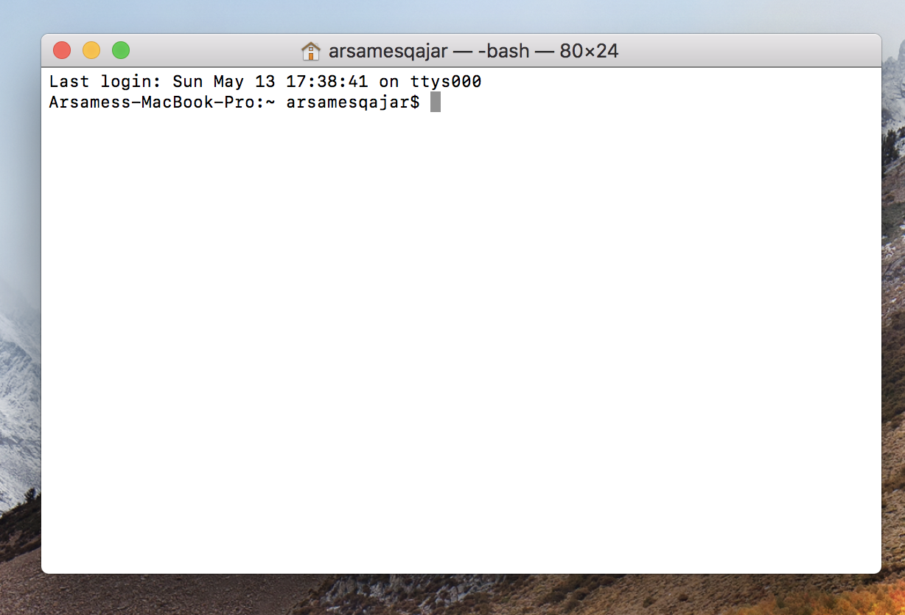

# Welcome to Git
#### `**Note: All below assumes Mac users. Sorry :/.`

## What is Git

useful links
+ [Git branches](https://gist.github.com/blackfalcon/8428401)
+ [Git workflow](https://guides.github.com/introduction/flow/)

## Table of Contents
  * [Chapter 1 - the Terminal](#chapter-1)
  * [Chapter 2 - Installing Git on Mac](#chapter-2)
  * [Chapter 3 - Getting Started with Git](#chapter-3)
  * [Chapter 4 - Branching with Git](#chapter-4)

## 
### Step 1: The Terminal 
1. To find your terminal, spotlight search for 'terminal' and select it. See below. 

2. Below, is an example of how the terminal will look like. Nice job! You're on your way now to becoming an engineer! :)

## 
### Step 2 - Installing Git on Mac
1. Before you install git,   .For more, [check this link here](https://www.atlassian.com/git/tutorials/install-git).
2. [NoSQL Distilled: A Brief Guide to the Emerging World of Polyglot Persistence](https://www.amazon.com/NoSQL-Distilled-Emerging-Polyglot-Persistence/dp/0321826620)

## Schedule   

|Schedule | Lecture/lab  |   
| --- | --- |
| Week 1     | Relational vs NonRelational Databases      
| Week 2     | Graph Database - *Neo4j*         
| Week 3     | Key-value - *Redis*         
| Week 4     | Column-family - *Cassandra*     
| Week 5     | Document Store -  *MongoDB*         
| Week 6     | Pymongo, Python and MongoDB              
| Week 7     | Choosing a NoSQL db landscape          
| Week 8     | Final

